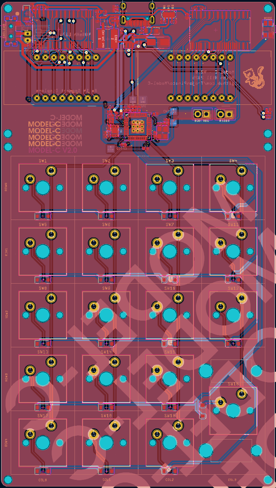
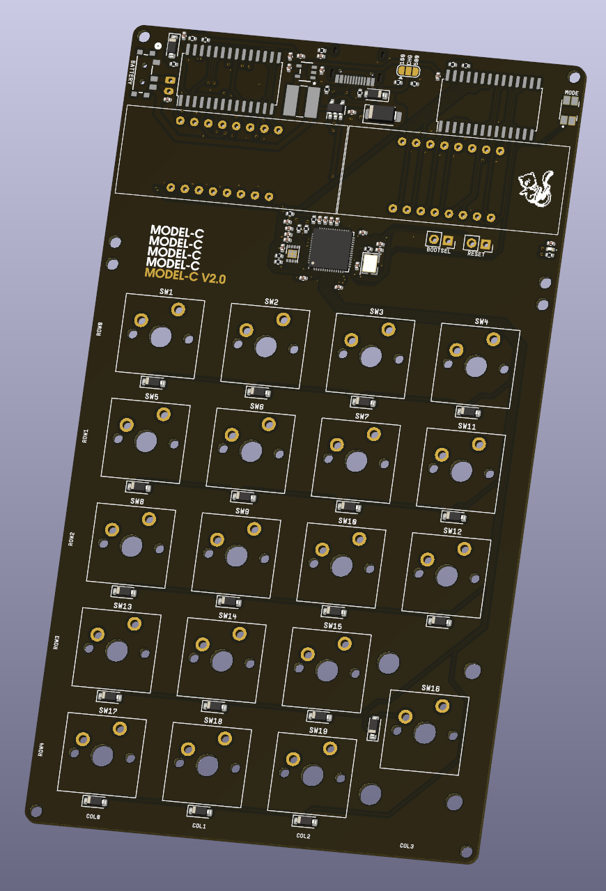
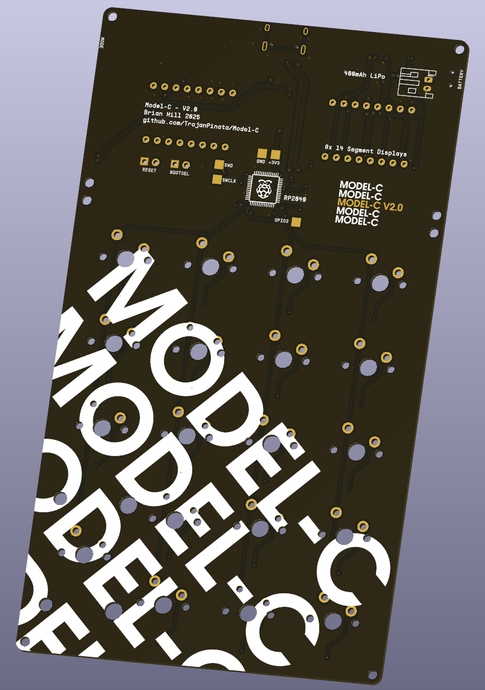

# Model-C

### A four function calculator and numpad combo with integrated battery, power-saving, and mechanical switches

The first version of this project is stored in the `old pcb` directory, and is based off of the ATmega32A MCU. While good, I felt like the RP2040 is more realistic in terms of both cost and development overhead.

